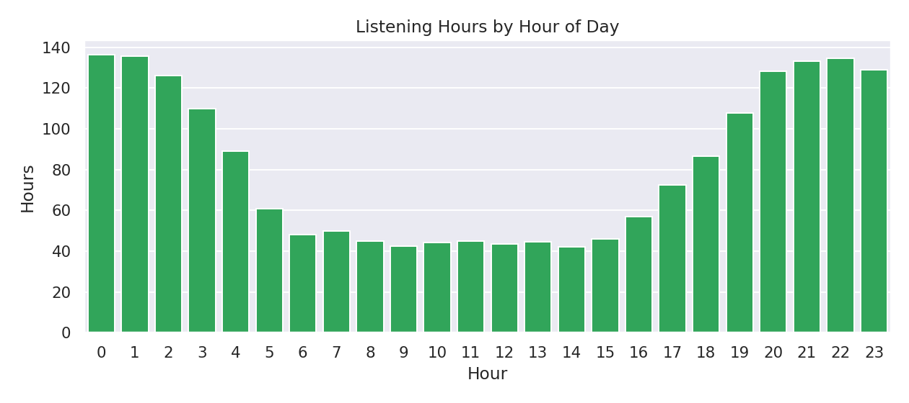

# Spotify Analytics Dashboard

Interactive Streamlit dashboard for exploring your Spotify listening history. It parses the exported "Spotify Account Data" JSON files and presents KPIs, trends, and insights.

## Features
- KPIs: total plays, listening hours, unique artists/tracks
- Filters: date range and artist selection
- Charts: top artists, daily listening trend, and a gauge for avg hours/day
- Caching and pre-processing to keep it snappy

## Project Structure
```
spotify-analytics-dashboard/
├── app.py
├── requirements.txt
├── README.md
├── .gitignore
├── .streamlit/
│   └── config.toml
├── data/
│   ├── raw/
│   └── processed/
├── src/
│   ├── __init__.py
│   ├── data_loader.py
│   ├── data_processor.py
│   ├── analytics.py
│   └── visualizations.py
└── scripts/
    └── prepare_data.py
```

## Quickstart

1) Ensure your exported folder exists. In this workspace it's at:
`../Spotify Account Data` (relative to this project folder).

Optionally set the environment variable `SPOTIFY_DATA_DIR` to a custom path.

2) Create a virtual environment and install deps:

```bash
python -m venv .venv
source .venv/bin/activate
pip install -r requirements.txt
```

3) Prepare data (first run only). This will build `data/processed/streaming_history.parquet`:

```bash
python scripts/prepare_data.py --source "../Spotify Account Data"
```

4) Run the app:

```bash
streamlit run app.py
```

Then open the URL shown in the terminal.

## Notes
- The app will try to use `data/processed/streaming_history.parquet` if it exists. If not, it will attempt to parse raw JSON from `SPOTIFY_DATA_DIR` or `../Spotify Account Data`.
- For large datasets, parquet is faster and smaller than CSV (requires `pyarrow`).

## License
MIT

## Insights (initial)

Based on your processed dataset (`data/processed/streaming_history.parquet`), here are your peak listening hours so far:

- Peak hours (overall): 00:00–01:00 is highest, followed by 01:00–02:00, 22:00–23:00, 21:00–22:00, 23:00–00:00, and 20:00–21:00.
- Weekdays: strongest at 00:00, 01:00, 21:00, 22:00.
- Weekends: strongest at 23:00, 22:00, 20:00, 01:00.

Interpretation: late‑night listening dominates, especially around midnight; weekends shift slightly earlier (22:00–23:00).

You can reproduce or refine these numbers by running the app (heatmap section) or doing a quick analysis in a Python shell:

```python
import pandas as pd
df = pd.read_parquet('data/processed/streaming_history.parquet')
df['hoursPlayed'] = df['msPlayed']/3_600_000.0 if 'hoursPlayed' not in df else df['hoursPlayed']
et = pd.to_datetime(df.get('endTime', df.get('date')))
df = df[~et.isna()].copy(); df['hour'] = et.dt.hour
print(df.groupby('hour')['hoursPlayed'].sum().sort_values(ascending=False).head(6))
```

## Screenshot



This image shows total listening hours by hour of day (computed from your processed data). The app itself provides interactive KPIs, heatmap, and drilldowns.

## Deploy to Streamlit Community Cloud

1. Push this repo to GitHub (already done).
2. Go to https://share.streamlit.io and sign in with GitHub.
3. Create a new app and select this repo/branch (`main`) and `app.py` as the entry point.
4. Add a secret or environment variable if your Spotify export lives outside the repo:
    - `SPOTIFY_DATA_DIR`: absolute path on the cloud or use the preprocessed parquet.
5. If you commit `data/processed/streaming_history.parquet` to the repo, the app will load instantly without raw JSON.

Tip: keep `requirements.txt` minimal and pinned for reproducible builds.

